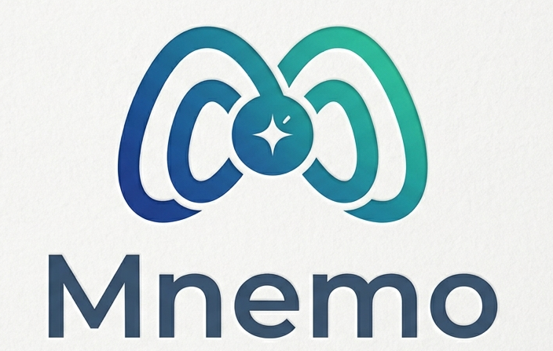

# 🧠 Mnemo: Your Shell's Memory & Foresight

<p align="center">
  
</p>

[](https://go.dev/)
[](https://www.zsh.org/)
[](https://opensource.org/licenses/GPL-3.0)
[](https://github.com/drasogun/mnemo/graphs/commit-activity)

**Mnemo** — named after the Greek muse of memory — is a fast, dependency-light zsh plugin that augments your shell with two complementary powers: **recall** (a fuzzy history picker) and **foresight** (on-demand AI command completion). It pairs a Go binary (heavy lifting) with a small zsh widget (line-editor glue) — the same architectural pattern that makes `fzf` reliable.

---

## ✨ Features

- ⚡ **Fuzzy History Recall**: A full-screen Bubble Tea TUI launches on `Ctrl+R`, fuzzy-matches across your entire `~/.zsh_history`, and drops the chosen command into your prompt buffer (no auto-execute).
- 🧠 **On-Demand AI Foresight**: Press `Alt+A` to send the current command to a local Ollama model. The completion appears as inline dim ghost text — accept with `Tab` or `→`, dismiss with any keystroke.
- 🪶 **Zero Hook Drama**: No `zle-line-pre-redraw` polling, no `zsh-autosuggestions` conflicts, no race conditions. Trigger keys only.
- 🔥 **Warm by Default**: Mnemo pre-loads the Ollama model in the background on shell startup so your first `Alt+A` is sub-second instead of 30+ seconds.
- 🧩 **Single Binary**: One Go binary, three subcommands (`pick`, `predict`, `warmup`). Statically linked, ~10 MB, runs anywhere.
- 🛡️ **Local-First**: Ollama runs on `localhost`. Your shell history never leaves your machine.
- 🎯 **Configurable**: Override every keybind, model, endpoint, timeout, or binary path via environment variables.
- 🔁 **Re-source Safe**: Wrapper widgets guard against double-sourcing — re-run `source ~/.zshrc` without infinite recursion.
- 🤝 **Plays Nice**: Coexists cleanly with `zsh-autosuggestions`, `zsh-syntax-highlighting`, `Powerlevel10k`, and oh-my-zsh.

---

## 🚀 Quick Start

### Build from Source

```bash
# Clone into your oh-my-zsh custom plugins directory
git clone https://github.com/drasogun/mnemo \
    ${ZSH_CUSTOM:-~/.oh-my-zsh/custom}/plugins/mnemo

cd ${ZSH_CUSTOM:-~/.oh-my-zsh/custom}/plugins/mnemo
go build -o mnemo .
```

### Enable the Plugin

Add `mnemo` to your `~/.zshrc` plugins list:

```zsh
plugins=(... zsh-autosuggestions zsh-syntax-highlighting mnemo)
```

Reload:

```bash
source ~/.zshrc
```

### Manual (no oh-my-zsh)

```bash
git clone https://github.com/drasogun/mnemo ~/.zsh/mnemo
cd ~/.zsh/mnemo && go build -o mnemo .
echo 'source ~/.zsh/mnemo/mnemo.plugin.zsh' >> ~/.zshrc
```

### 🧠 Brain Setup (Ollama, optional)

The history picker works without Ollama. AI foresight needs a running Ollama server and a model:

```bash
# 1. Install Ollama
curl -fsSL https://ollama.com/install.sh | sh

# 2. Pull a small, fast coding model
ollama pull qwen2.5-coder:1.5b

# 3. Start the server (systemd usually does this automatically)
ollama serve &
```

Verify the server is reachable:

```bash
curl -s http://localhost:11434/api/tags | head
```

On the next shell start, Mnemo will pre-warm the model in the background so your first `Alt+A` returns in sub-second instead of waiting for the cold-load.

---

## ⌨️ Keybindings

### At the prompt

| Key | Action |
|-----|--------|
| `Ctrl+R` | Open the fuzzy history picker (TUI) |
| `Alt+A`  | Ask Ollama to complete the current command |
| `Tab`    | Accept ghost text — falls through to normal completion when no ghost |
| `→`      | Accept ghost text at boundary — falls through to `forward-char` otherwise |
| _any other key_ | Clears ghost text and edits normally |

### Inside the picker TUI

| Key | Action |
|-----|--------|
| _type_ | Refine the fuzzy filter |
| `↑` / `Ctrl+P` / `Ctrl+K` | Move selection up |
| `↓` / `Ctrl+N` / `Ctrl+J` | Move selection down |
| `Enter` | Send selection to shell buffer (no execute) |
| `Esc` / `Ctrl+C` / `Ctrl+G` | Cancel — buffer untouched |

---

## 🛠 Configuration

All configuration is environment-variable driven. Set these in `~/.zshrc` **before** the plugins line:

```zsh
# Keybindings
export MNEMO_KEYBIND='^R'              # picker (default: Ctrl+R)
export MNEMO_PREDICT_KEY='\ea'         # predict (default: Alt+A)

# Ollama
export MNEMO_MODEL='qwen2.5-coder:1.5b'
export MNEMO_OLLAMA_URL='http://localhost:11434/api/generate'
export MNEMO_TIMEOUT=30                # seconds, per-call
export MNEMO_KEEP_ALIVE='30m'          # how long Ollama keeps the model in RAM

# Behavior
export MNEMO_WARMUP=1                  # 0 to disable startup warmup
export MNEMO_BIN=/usr/local/bin/mnemo  # binary lookup override (rarely needed)
```

Common keybind escape codes: `'^R'` = Ctrl+R, `'^T'` = Ctrl+T, `'\ea'` = Alt+A, `'\eh'` = Alt+H, `'\e[Z'` = Shift+Tab.

Binary lookup order: `$MNEMO_BIN` → `$PATH` → next to the plugin file.

---

## 🧠 Technical Core

Mnemo is built around a clear separation between **shell-side widgets** and a **Go binary backend**:

- **Stateless Subcommands**: `mnemo pick`, `mnemo predict`, and `mnemo warmup` are pure functions — input via args/stdin, output via stdout, signals via exit codes (0 = success, 1 = cancelled / no result, 2 = backend error).
- **TTY Discipline**: The TUI opens `/dev/tty` directly for input/output, leaving stdout free to carry the selection back to the calling shell. Same trick `fzf` uses.
- **Bubble Tea TUI**: The picker uses [Bubble Tea](https://github.com/charmbracelet/bubbletea), [Lip Gloss](https://github.com/charmbracelet/lipgloss), and [sahilm/fuzzy](https://github.com/sahilm/fuzzy). Renders up to 10 visible matches with scroll, refilters on every keystroke, sub-millisecond.
- **History Loader**: Streams `~/.zsh_history` line-by-line, strips zsh's `: timestamp:elapsed;` extended-history prefix, dedupes newest-first, handles multi-line continuations (`\`-terminated lines).
- **Raw-Mode Prompt Engineering**: The predictor uses Ollama's `raw: true` mode with a few-shot `$ ` prefix prompt so even tiny coder models (1.5B) reliably continue text rather than refusing the request as a chat.
- **Keep-Alive Hint**: Each request asks Ollama to retain the model in RAM for 30 minutes (`keep_alive`), keeping warm-state predictions in the 100–300 ms range.
- **Ghost-Text Renderer**: The widget appends prediction suffix to `$BUFFER`, registers a `region_highlight` entry styling it dim-cyan, keeps `$CURSOR` parked at the typed-text boundary. Pauses `zsh-autosuggestions` while active.
- **Message Ownership Tracking**: A `_MNEMO_MSG_ACTIVE` flag prevents stale `zle -M` messages bleeding into the next prompt — only our own messages get cleared on edit.

---

## 📂 Project Structure

```
.
├── main.go              — entrypoint + subcommand dispatch
├── history.go           — zsh_history parser + dedupe
├── history_test.go      — parser unit tests
├── tui.go               — Bubble Tea picker model + view
├── predict.go           — Ollama HTTP client + warmup
├── mnemo.plugin.zsh     — zsh widgets + keybindings
├── go.mod / go.sum      — Go module manifest
├── README.md            — this file
├── CONTRIBUTING.md      — contributor guidelines
└── LICENSE              — GPL-3.0
```

---

## 🔬 Subcommands

```bash
mnemo                    # picker mode (default, no args)
mnemo pick [query]       # picker mode (explicit)
mnemo predict <buffer>   # one-shot Ollama completion → stdout
mnemo warmup             # touch Ollama so the model stays in RAM
```

| Mode    | Exit 0 | Exit 1 | Exit 2 |
|---------|--------|--------|--------|
| `pick`    | selection on stdout | user cancelled | history read error |
| `predict` | prediction on stdout | empty input / no prediction | Ollama unreachable |
| `warmup`  | model loaded | n/a | Ollama unreachable |

---

## 🏗 Development Guidelines

### Core Principles

- **Reliability over cleverness**: trigger-key UX beats async polling. Every interaction is synchronous with clear exit codes.
- **Boundary discipline**: Go owns parsing, TUI, and HTTP. Zsh owns line-editor mutation. They communicate only via stdout/stderr/exit.
- **Defensive widgets**: re-source guards (`zle -l ... &>/dev/null`) prevent infinite recursion on repeated `source ~/.zshrc`.

### Workflow

```bash
# Run tests
go test ./...

# Format
go fmt ./...

# Build
go build -o mnemo .

# Sync to oh-my-zsh plugin dir
cp mnemo mnemo.plugin.zsh README.md ~/.oh-my-zsh/custom/plugins/mnemo/

# Reload your shell
source ~/.zshrc
```

See [CONTRIBUTING.md](CONTRIBUTING.md) for the full contributor workflow, commit conventions, and code-style rules.

---

## 🤝 Compatibility

- ✅ `zsh-autosuggestions` — paused while AI ghost is visible, re-enabled on accept/clear
- ✅ `zsh-syntax-highlighting`
- ✅ Powerlevel10k (including instant prompt)
- ✅ oh-my-zsh and bare zsh
- ✅ Linux, macOS

---

## 📝 License

This project is licensed under the GPL-3.0 License — see the [LICENSE](LICENSE) file for details.

---

<p align="center">
  <i>Mnemo — your shell remembers, and anticipates.</i>
</p>
